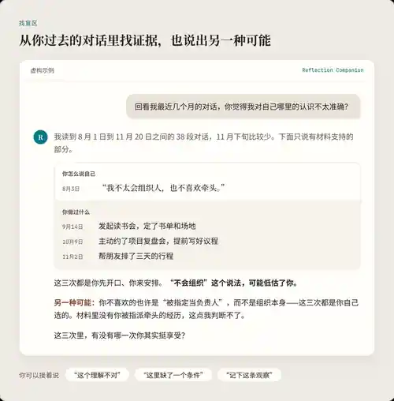
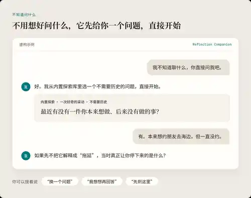
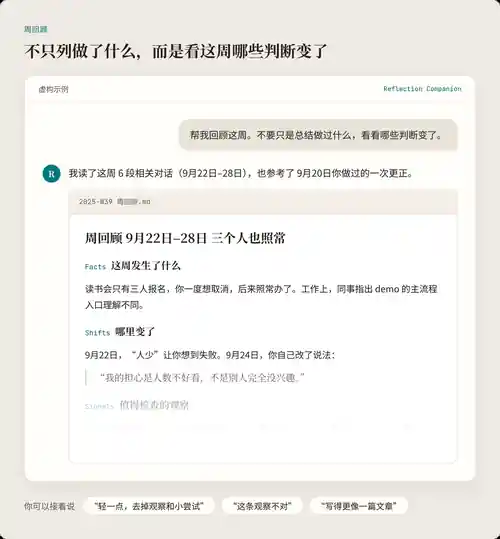

# Reflection Companion

**简体中文** | [English](README.md)

**不是让 AI 更了解你，而是帮助你更了解自己。**

Reflection Companion 是一个 AI 反思伙伴。它把你已经留下的经历、对话和思考痕迹重新变成材料，帮助你回顾变化、看见自己未必察觉的思维模式、检查判断、发现新的视角，并在你愿意时保留值得继续思考的东西。

你可以用它写日记、做周回顾、复盘一段经历；也可以让它从一段时间的材料里寻找可能反复出现的模式或盲点，陪你重新理解一个问题，或者尝试新的自我探索方式。

**Public Alpha · v0.5.6**

目前提供 Codex、Claude Code 和 Claude 网页版。

**快速跳转：** [从一个问题开始](#start-one-question) · [看回顾示例](#review-examples) · [安装](#install) · [常见问题](#faq)

---

## 1. 为什么做 Reflection Companion

“认识你自己”是一个很古老的问题。

新的地方在于，今天很多人已经在和 AI 一起思考。

我们和 AI 聊工作、关系、兴趣、选择、困惑和计划。时间久了，这些对话里留下的不只是问题和答案，还包括：

- 我们怎样定义一个问题；
- 做决定时反复使用什么标准；
- 什么事情总让我们卡住；
- 哪些解释我们习惯采用；
- 什么新信息会让我们改变想法；
- 曾经非常重要的东西，后来是否还重要。

有些模式只有拉开一点距离、把不同时间的经历放在一起看，才会显出来。你可能并不会主动意识到：“原来每次遇到不确定，我都会用同一种方式回应。”

**很多改变的第一步，不是立刻找到答案，而是先看见正在发生什么。**

这些材料通常在解决眼前问题之后，就沉进聊天记录里。

Reflection Companion 想做的，是把它们重新拿回来。

不是为了给你生成一个固定的“人格画像”，也不是让 AI 替你解释人生，而是帮助你从自己的经历里看到更多：**发生过什么、什么正在变化、哪些思考方式可能反复出现、你的判断建立在什么之上，还有什么值得继续想。**

聊天记录不是完整的你，但它们可以成为理解自己的材料。

---

## 2. 它可以怎样帮助你

### 2.1 回看经历和变化

把不同时间的想法联系起来，而不是只总结最近说过什么。

你可能会发现：

- 一个原本很重要的目标已经没那么重要；
- 对同一件事，你现在使用了不同的判断标准；
- 有些东西变化很大，有些东西其实一直没变；
- 某个悬而未决的问题，后来已经有了答案。

日记、周回顾、月度或阶段复盘，都属于这一类。

### 2.2 发现自己未必察觉的模式

我们通常只能从当下的位置理解自己。

但一些东西会散落在不同的对话和经历里：类似的担忧、重复出现的判断方式、遇到某种情境时相似的反应，或者同一个问题换了形式又回来。

当有足够材料时，Reflection Companion 可以把这些片段放在一起，提出一个**值得检查的模式**：

- 每当信息还不够确定时，我是不是容易继续准备，而迟迟不开始？
- 我是不是经常先假设自己做得不够好，再去寻找证据？
- 某类选择里，我是不是一直在保护同一个东西？
- 看起来完全不同的几个问题，底下是不是有相似的判断标准？

这些不是诊断，也不是关于你的定论。

一次重复不等于模式；缺少反例也不等于证明。

它应该把观察、推测和你的确认区分开来。你可以说“不是这样”，也可以用新的经历修正原来的理解。



### 2.3 看清自己的思考方式

有时候我们需要的不是另一个建议，而是重新看看自己的解释。

Reflection Companion 可以一起检查：

- 我是不是把一个假设当成了事实？
- 有没有同样合理的另一种解释？
- 我说自己“总是这样”，证据真的支持吗？
- 哪个条件被我忽略了？
- 我现在纠结的，还是最初那个问题吗？

它不以反驳你为目标。原来的判断也可能是合理的。

重要的是，让判断本身变得更清楚。

### 2.4 遇见当前思路之外的东西

有些时候，值得做的不是继续分析，而是打开一个新的方向。

Reflection Companion 可以根据当前问题，带入相关的概念、经验、问题或探索方式，并说明为什么它可能和你有关。

目的不是制造随机的“灵感”，而是帮助你看到自己原本没有在看的部分。

### 2.5 让值得留下的理解继续生长

有些东西值得跨过一次聊天继续存在：

一次真正改变了的决定、一个被纠正的旧理解、一个还没有答案的问题，或者一个反复出现但尚未确认的模式。

当你明确选择保存时，Reflection Companion 可以保留这些内容，并在以后相关的讨论中继续使用。

新的经历也可以推翻旧的理解。

**它保存的不是“关于你的真相”，而是可以继续被检查、修正和更新的材料。**

---

## 3. 从你现在正在经历的事情开始

不需要学习命令，也不需要先建立完整个人档案。

直接说你现在想做什么就可以。

| 如果你现在想…… | 可以这样开始 |
| --- | --- |
| 不知道该问什么 | “帮我选一个可以更了解自己的问题，直接问我。” |
| 整理一天 | “帮我回顾今天值得记住的几件事，看看我在意什么、有什么变化。缺的地方再问我。” |
| 回顾一周 | “帮我回顾这周。不要只是总结做过什么，看看哪些判断变了、哪些事情有了结果、还有什么值得继续想。” |
| 复盘一段经历 | “帮我回顾这个项目从开始到现在：我一开始是怎么想的，后来哪些判断变了，哪些标准一直没变？” |
| 看看有没有反复出现的模式 | “回看最近这段时间的讨论，有没有什么反复出现、但我自己可能没注意到的思考方式？只说有材料支持的，先把它当成待验证的观察。” |
| 检查一个判断 | “我总觉得自己是在逃避这件事。先别顺着这个解释，帮我看看它有哪些证据，还可能有哪些其他解释。” |
| 想更了解自己 | “最近有什么适合尝试的自我探索方式？给我几个差别大一点的，我选一个后直接开始。” |
| 只想记住一件小事 | “我想把今天这件小事记下来，不需要分析太多。” |

同一个 Companion 可以在这些场景之间自然切换。

<a id="start-one-question"></a>

### 3.1 不知道该问什么？先给你一个问题

不需要先写日记，也不用想好要探索什么。直接说：

> “帮我选一个可以更了解自己的问题，直接问我。”

它会从内置库选一个适合当前材料的问题并开始。没有历史也能从一个日常选择聊起；你可以说“轻一点”“深一点”“犀利一点”或“好玩一点”。想自己选，就让它给两三个不同方向。

想结合过去的讨论找盲区、比较自我认识与行为、探索幸福感或当下优先级，它应先检查实际能读到的历史，再说明证据、反例与限制。缺少历史就不能得出“你一直如此”的结论。你也可以试“善意吐槽”或“如果只剩这些痕迹”。

想找新灵感，可以说“最近有什么新的自我探索问题值得试？”它会先读动态目录；需要近期公开内容时，再核查网络来源。说“换个方向”只是在调整这次探索。



### 3.2 也可以让回顾主动发生

如果你使用的平台支持定时任务，日记和回顾不一定每次都要靠你想起来再打开。

你可以选择设置，例如：

- 每晚提醒你简单回顾一天；
- 定期根据约定范围内可访问的材料生成日记草稿；
- 每周回看这一周发生的变化和仍然开放的问题；
- 定期带来一个新的自我探索方式。

这些都需要你主动设置范围、时间和保存方式。

安装 Reflection Companion 本身**不会自动创建任何定时任务**。不同平台对定时执行、材料访问和无人值守送达的支持也不同，具体能力以平台说明为准。

<a id="review-examples"></a>

## 4. 不同时间尺度，回顾的重点也不同

**日、周、月、季度、年不是同一份总结换一个时间范围。** 时间跨度不同，回顾需要关注和联系的信息也不同：日记更接近生活现场；时间越长，越需要比较前后证据、重新检查判断，并辨认跨时间出现的模式和它们的边界。

| 周期 | 回顾的重点 |
| --- | --- |
| 日 | 具体场景、你表达过的感受、值得记住的瞬间。 |
| 周 | 发生了什么，哪些判断变了，哪些观察还需要核查。 |
| 月 | 哪些主线更有依据，注意力去了哪里，哪些解释需要修订。 |
| 季度 | 跨月方向、可能的模式，以及它们不成立的条件。 |
| 年 | 不同阶段、选择、普通生活与意愿，不强制写成成长故事。 |

下面的虚构周回顾示例展示：事实与判断变化怎样被联系起来，同时不被写成人格结论。它是编写示范，不是用户真实记录或宿主评测结果。



[阅读五个周期的完整成品及关闭分析的变体](plugins/reflection-companion/skills/reflection-companion/assets/examples/reviews.zh-CN.md)。

这些结构是可调整的起点，不是固定表格。你可以要求它更多保留原话、更像一篇自然的日记／回顾，或减少分析；也可以关闭 AI 观察和提问。更详细的输出选择与保存规则见[使用指南](docs/USER_GUIDE.zh-CN.md)。

历史回填需要同时核对“取回了什么”和“正文写入了什么”。已有记忆、近期历史游标结束，都不能证明全部账户历史。日记不需要等长，重要讨论与更正不能因固定消息上限而消失。你可以把日记和周记放在同一个每周 Tab，月／季回顾也放在同一文档；既有归档约定和你的当前选择决定组织方式。

---

<a id="install"></a>

## 5. 安装并开始

当前公开版本为 **v0.5.6 Public Alpha**。

支持：

- **Codex**
- **Claude Code**
- **Claude 网页版**

从这里选择对应平台：

[查看 v0.5.6 Release](https://github.com/zhenglimindesign-ing/reflection-companion/releases/tag/v0.5.6)

**首次安装 Codex 插件**时，先登记发布版 marketplace，再安装其中的插件：

```sh
codex plugin marketplace add https://github.com/zhenglimindesign-ing/reflection-companion.git --ref v0.5.6
codex plugin add reflection-companion@reflection-companion
codex plugin list --marketplace reflection-companion --json
```

核对安装项已启用，版本为 `0.5.6`。用 `codex` 开一个新的 CLI 会话，或在桌面端开一个已启用 Reflection Companion 的新 chat，再直接描述需要。若没有这些子命令，先检查 `codex --version` 和 `codex plugin --help`。

已有安装、下载 ZIP 后的安装路径、其他宿主及验证边界，见[平台安装与验证范围](docs/PLATFORMS.zh-CN.md)。

安装之后，不需要先配置个人档案或开启保存。

可以直接从一句自然语言开始，例如：

> “帮我回顾这周最近让我比较在意的几件事，先看看有没有什么变化。”

或者：

> “这件事我想了很久。帮我一起看看，我现在的解释可能遗漏了什么。”

---

<details>
<summary><strong>5.1 模型与思考档位的起步建议</strong></summary>

从宿主当前的主力通用模型和默认思考档位开始。Codex 中，**GPT-6.1 Sol** 在你的模型菜单可用时可以作为起点；Claude 使用当前可用的通用模型即可。Skill 不要求固定厂商或型号。

几则材料写成的一篇短日记适合首次试用。来源覆盖已经检查后，如果跨多个来源或月份的回顾仍漏掉早期证据、遗漏更正，或混淆用户陈述与 AI 解释，可以尝试 **high** 档位。这是便于起步的实践建议，不是模型排名，也不要求每次选择最高档位。

更高档位会花更多时间和 token，无法补齐宿主取不到的历史。先检查来源和实际成品，再调整档位。助手不能仅凭本 README 的建议自行切换你的模型或设置。参见 [OpenAI 的模型与思考档位说明](https://developers.openai.com/codex/models)。

</details>

## 6. 材料、保存与边界

Reflection Companion 只使用当前平台**实际能够访问**、以及你主动提供或授权使用的材料。

安装 Skill：

- 不会自动获得你所有平台的聊天历史；
- 不会自动开启个人记录；
- 不会自动创建定时任务；
- 不会把你的私人回答加入公共探索库。

不同平台能够访问的历史、文件和跨对话能力不同。需要历史材料时，它应该说明自己实际覆盖了什么，而不是假装读过完整记录。

补齐整个时期的记录前，它应检查来源发现与正文覆盖，使用可用入口修复检索缺口，并在宣布归档完成前说明仍取不到的部分。近期列表或没有下一页的游标，都不能单独证明历史完整。已有记录是基线，新产出应有自己的核验链接；你要求另建对比稿时，原文件保持不动。

个人日记、原话和来源索引保存在你指定的私人位置。产品仓库的输出或临时目录不能默认充当私人档案，即使仓库本身是私有的。伙伴应完成已授权的写作、保存和读回核验，再告诉你剩下什么，或明确说明没有后续事项。

对你的解释也不是定论。

你可以随时说：

- “这个理解不对。”
- “这里缺了一个重要条件。”
- “我不觉得这是一个稳定模式。”
- “不要保存这个。”
- “停。”

如果开启本地连续性，保存内容仍然应该保留来源、状态和纠正记录，并允许以后检查、修改或删除。

Reflection Companion 不是心理诊断工具，也不应该根据零散材料给你贴固定人格标签。

**意义仍然属于你。**

---

## 7. 这些问题和探索方式从哪里来？

- **内置库**：内置库包含 23 个原创双语脚手架，覆盖六个主题，不联网也能用。问一个问题、点名玩法，或让它给几个选项都可以。
- **当前情境**：根据正在聊的问题调整玩法；不会因为你没提过某件事，就推断你不了解它。
- **新的公开灵感**：明确问“有什么新的”时，先读取可独立更新的动态目录；目录过时、不足或你要求近期网络内容时，再核查公开来源。

动态目录的收录日期、原文发布日期和热度是不同的事。没有热度证据就不称“热门”；读取失败时说明随包快照日期，并可继续使用内置问题。目录更新需要实际人工寻找、核查、改写和发布，目前没有自动采集服务。你的私人回答不会进入公共库。

[浏览内置探索库](https://github.com/zhenglimindesign-ing/reflection-companion/blob/main/docs/PROMPTS.zh-CN.md)

---

<a id="faq"></a>

## 8. 常见问题

<details>
<summary><strong>8.1 我平时主要在 ChatGPT 里聊。Reflection Companion 装在 Codex 后，还能用这些对话吗？</strong></summary>

**可以——至少在我们实际验证过的 Codex owner-account 环境里是可以的。** Reflection Companion 曾跨多个 thread 取回真实的 ChatGPT 消息正文、日期和原始链接，并据此完成日／周回顾。这种跨 surface 的历史取回能力，也是当前选择 Codex 作为主要宿主入口的重要原因之一。

OpenAI 官方说明里，Codex 自己的聊天列表与 ChatGPT Chat 里的 history 是分开的；但**界面中的历史列表分开，不等于 Codex 的宿主检索一定拿不到相关 ChatGPT 对话**。实际可取回范围仍可能受账号、客户端、workspace 权限和平台变化影响，所以 Reflection Companion 会先检查自己真正能读到什么，再说明覆盖范围，而不是一上来就假设“读不到”或保证“全部都有”。详见[平台验证与来源边界](docs/PLATFORMS.zh-CN.md)以及 OpenAI 的 [ChatGPT Work and Codex](https://help.openai.com/en/articles/20001275-chatgpt-work-and-codex)。

</details>

<details>
<summary><strong>8.2 那 Claude 和 Claude Code 呢？</strong></summary>

在支持的 Claude 付费聊天端，Claude 可以搜索过去的 Claude 对话并引用来源。至于 **Claude Code**，当前这个版本还没有验证到和 Codex→ChatGPT 同等级别的“跨 surface 读取 Claude 聊天档案”能力。Claude Code 可以使用当前会话、获准的项目／文件，以及自己的项目／会话记忆，例如 `CLAUDE.md` 和 auto-memory。

如果过去的 Claude 对话对这次反思很重要，可以在支持 chat search 的 Claude 聊天端使用，或把相关内容导出／提供给 Claude Code。这里是**尚未验证的能力边界**，不是说它永远不可能支持。参见 [Claude 的聊天搜索与 Memory](https://support.claude.com/en/articles/11817273-use-claude-s-chat-search-and-memory-to-build-on-previous-context)。

</details>

<details>
<summary><strong>8.3 Reflection Companion 实际会用哪些材料？</strong></summary>

视宿主能力和你的选择，它可以使用：

- 当前这段对话；
- 当前宿主实际能够取回的过去对话；
- 你提供或授权读取的文件、导出、日记和项目材料；
- 可选的 Reflection Companion 本地状态，例如保存的收获、纠正和输出偏好；
- 宿主 Memory，作为背景或帮助定位材料的线索；
- 在需要外部知识／探索灵感时使用的公共目录或网络来源。

涉及历史判断时，带日期的原始对话／文件比 Memory、标题或旧 AI 总结具有更高证据权重；网络资料也不能替代你的个人历史。

</details>

<details>
<summary><strong>8.4 它通常能读到多少过去的聊天？</strong></summary>

取决于宿主和任务。在我们自己的 Codex owner-account 测试里，Reflection Companion 已经能按日期跨多个 ChatGPT thread 取回相当广的历史材料；但这不代表每个账号的每一条对话、附件或音频都一定可用。

一个具体问题通常不需要完整历史。像年回顾、或“我有什么反复出现的模式”这种更宽的问题，才需要先看实际时间／主题覆盖，能修复的来源缺口先修复，再把仍然缺的部分说清楚。

</details>

<details>
<summary><strong>8.5 使用前一定要写日记、开启保存或设置定时吗？</strong></summary>

不用。你可以完全不保存，从一个问题、一件事或当前对话直接开始。保存、长期偏好和定时回顾都是之后单独选择的 opt-in 能力。

</details>

<details>
<summary><strong>8.6 普通 ChatGPT / Claude 也可以回答这些问题，为什么还要用这个 Skill？</strong></summary>

一次性的提问，很多时候普通聊天当然也可以。Reflection Companion **不是一个特殊模型，也不靠一条“秘密 prompt”成立。**

这个 Skill 增加的是一套可重复的反思方式：先检查宿主真正能用哪些材料，区分你的原话和 AI 的解释，把不同时间的证据放在一起比较，主动处理纠正与反例；当你不知道该问什么时给一个合适的脚手架；只有你明确授权时，才把收获带到以后。之后，同一套规则还可以继续用于日记、周期回顾和定时反思。

如果你只想随手问一次，普通聊天可能已经足够；如果你希望反思长期保持**有来源、跨时间、可纠正、可复用**，这个 Skill 会更有价值。

---

</details>

## 9. 继续阅读

- [场景与进阶指南](docs/USER_GUIDE.zh-CN.md) — 日记、周回顾、保存、纠正与定时
- [完整对话示例](docs/EXAMPLES.zh-CN.md) — 看一次讨论怎样展开
- [平台安装与验证范围](docs/PLATFORMS.zh-CN.md) — Codex、Claude Code、Claude Web
- [手机文字体验](docs/MOBILE.zh-CN.md) — 在手机上先体验一次方法
- [更新记录](CHANGELOG.zh-CN.md)

这是一个公开 Alpha。

如果你愿意试一次，最有价值的反馈不是“好不好”，而是：

**哪一段真的帮到了你？哪一个解释不像你？哪一步让你不知道该继续怎么用？你以后会在什么情况下再打开它？**

[提交反馈或问题](https://github.com/zhenglimindesign-ing/reflection-companion/issues/new/choose)

[参与改进](CONTRIBUTING.zh-CN.md) — 欢迎文档、翻译、虚构失败案例和安装记录；指南说明如何提案、验收和记录贡献。

MIT License.
