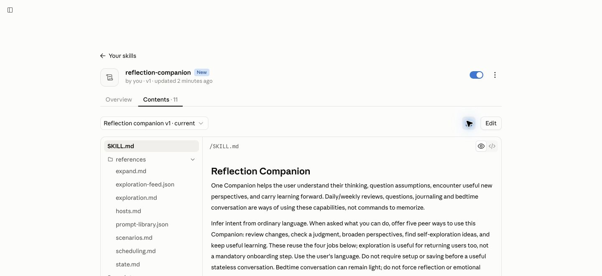
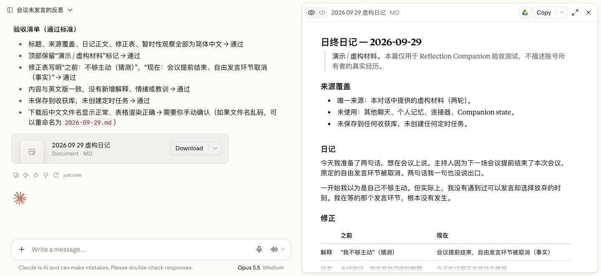

# 平台安装详情与验证范围

**简体中文** | [English](PLATFORMS.md)

[产品介绍与快速开始](../README.zh-CN.md) · [手机体验](MOBILE.zh-CN.md) · [场景与进阶指南](USER_GUIDE.zh-CN.md)

第一次安装和开始对话的基本步骤已放在 README。本页提供各平台的安装细节、截图、升级说明和有日期的验证记录；需要解决具体平台问题时再查阅。

当前公开 Alpha **v0.5.9** 提供 Codex 插件、Claude Code 项目 Skill 和 Claude 网页版 Skill。[下载对应平台包](https://github.com/zhenglimindesign-ing/reflection-companion/releases/tag/v0.5.9)。三个入口共用同一份核心，安装包按宿主区分。

## Claude Code 与 Claude 网页版区别

| | Claude Code | Claude 网页版 |
| --- | --- | --- |
| 适合谁 | 在电脑上使用项目、文件的用户；通常从终端进入。 | 想在网页聊天里使用 Skill 的用户。 |
| 怎么装 | 把 Skill 放在选定项目的 `.claude/skills/reflection-companion/`。 | 在 Customize → Skills 上传专用 ZIP，并启用所需代码执行能力。 |
| 怎么叫它 | `/reflection-companion`，或让 Claude 根据请求自动匹配。 | 开启 Skill 后自然描述需求，由宿主匹配；不假设同一个斜杠命令。 |
| 它能看什么 | 当前上下文及获准读取的项目/本地文件。 | 当前对话、主动上传的材料和实际提供的工具。 |
| 日记放哪里 | 获准的本地目录，可读回。 | 可生成可下载文件；不能据此声称已保存到你电脑或跨 chat 永久保留。 |
| 定时 | 取决于当前宿主提供的工具与运行条件。 | 同样需要检查账户工具，上传 Skill 不会创建任务。 |

区别涉及材料、权限与文件寿命，不只是叫它的方式。两种安装包从同一份核心 Skill 生成，不维护两套反思逻辑。说明依据 [Claude Code Skills](https://code.claude.com/docs/en/skills) 与 [Claude 自定义 Skills](https://support.claude.com/en/articles/12512198-how-to-create-custom-skills)。

## 聊天历史、Memory 与跨 surface 访问

同一个厂商账号可以让不同 surface 共享一部分有用上下文，但具体机制并不相同。

- **ChatGPT → Codex——我们已经在 owner-account 实测过。** 多个全新的 Codex 会话通过宿主历史工具跨 thread 取回真实 ChatGPT 消息正文，并保留分页、日期和 ChatGPT 原始链接；打包后的 Daily / Weekly Reflection Companion 也继续使用这种来源级取回，而不是只靠泛化 Memory。OpenAI 另外说明 Codex 自己的聊天 history 在产品界面上与 ChatGPT history 分开；这和“Codex 的宿主检索能否取到相关 ChatGPT thread”不是同一个问题。具体可用范围仍应按账号／客户端／workspace 实际检查。
- **Claude 聊天端——官方支持过去聊天搜索。** Anthropic 已说明在支持的付费 Claude 网页、桌面和移动端，可以搜索过去对话，并引用回原始 chat。
- **Claude Code——目前是不同的证据边界。** 当前版本尚未验证 Claude Code 可以同样读取 Claude 聊天档案。Claude Code 有自己的 session／project context、`CLAUDE.md`、可恢复的本地 session 和 auto-memory；跨 surface 历史不可用时，可以使用导出／提供的 Claude 对话。

对 Reflection Companion 来说，材料优先级是实用的：当前对话和实际取回的带日期原始材料优先；需要时使用你提供的文件／导出与获授权的本地状态；宿主 Memory、标题和旧总结可以帮助定向或找材料；公共目录／网络只用于外部事实和探索灵感。一次有用的反思并不要求完整人生档案，但结论越宽，越需要更宽且核实过的材料覆盖。

参考：OpenAI [ChatGPT Work and Codex](https://help.openai.com/en/articles/20001275-chatgpt-work-and-codex)、[Using Codex with your ChatGPT plan](https://help.openai.com/en/articles/11369540-using-codex-with-your-chatgpt-plan)、[Memory in ChatGPT](https://help.openai.com/en/articles/8590148-memory-in-chatgpt)；Anthropic [Claude 的聊天搜索与 Memory](https://support.claude.com/en/articles/11817273-use-claude-s-chat-search-and-memory-to-build-on-previous-context)、[Claude Code power-user tips](https://support.claude.com/en/articles/14554000-claude-code-power-user-tips)。


## Codex：当前公开版

### 首次安装

[README](../README.zh-CN.md) 给出了固定在 v0.5.9 的 Git marketplace 安装路径。先登记 marketplace，再运行 `codex plugin add`；安装命令需要 `reflection-companion@reflection-companion`，同时指定插件和 marketplace。参见 [OpenAI 的 marketplace 来源说明](https://developers.openai.com/plugins/build/plugins#build-your-own-curated-plugin-list)。

也可以从发布页下载 `reflection-companion-0.5.9.zip`，对照同一发布页的 `SHA256SUMS.txt` 校验摘要，再把完整包解压到一个稳定的本地目录。marketplace 根目录是解压后的 `reflection-companion-0.5.9` 文件夹，其中包含 `.agents/plugins/marketplace.json` 和 `plugins/reflection-companion/`；**不是** ZIP 文件本身，也不是内层 Skill 文件夹。部分系统会隐藏 `.agents`。

把下面的示例路径换成实际解压根目录：

```sh
codex plugin marketplace add /path/to/reflection-companion-0.5.9
codex plugin add reflection-companion@reflection-companion
codex plugin list --marketplace reflection-companion --json
```

首次安装选择一种来源路径即可；本地来源需保留，供后续刷新使用。列表应显示已安装、已启用且版本为 `0.5.9` 的项目。若当前 CLI 缺少这些子命令，记录 `codex --version` 和 `codex plugin --help` 的结果；这些步骤本身不构成 Linux 支持验证。

安装后按界面要求刷新，用 `codex` 开新 CLI 会话，或在桌面端开已启用 Reflection Companion 的新 chat，用虚构请求试调用：“陪我写一篇想象中的散步日记，一次问一个问题；先不保存。”核对当前 chat 实际能使用这个 Skill。安装和列出命令成功，不能单独证明首次调用成功。

### 已有安装与更新

若已登记 `reflection-companion`，先核对现有安装，按下方更新流程处理，不要用首次安装命令替换已有来源。

可以直接要求检查新版、升级到指定正式版或退回上一版。检查不改变安装，固定 ref 不会自动跳到新版。保持同一个插件 ID `reflection-companion@reflection-companion`，日记和偏好目录保留在插件缓存之外。

**0.5.1 发布版**增加 Python 3.11+ 助手，支持检查、校验后准备、升级和基于回执的回退。它备份已有插件，通过原生 CLI 安装，核对实际文件及无关设置；失败时尝试恢复一次。原生恢复需要 Git 来源可访问，保留备份不等于可以自动离线恢复。具体步骤见[安装更新规则](../plugins/reflection-companion/skills/reflection-companion/references/updates.md)。公开 0.5.0 不含这个助手；首次过渡需要经审查的当前 checkout，或由宿主协助安装。

“文件已安装”和“当前 chat 已加载”分别说明，按宿主提示刷新并核对一次新会话调用。恢复受阻时保留回执及备份，处理具体失败；不要移除整个 marketplace 或覆盖无关设置。见[维护与恢复](MAINTAINING.zh-CN.md)。

## Claude Code：公开 Alpha 包

下载 `reflection-companion-claude-code-0.5.9.zip`，使用同一发布页的 `SHA256SUMS.txt` 校验，在一个选定的个人项目中解压。应得到 `.claude/skills/reflection-companion/SKILL.md`；`.claude` 是隐藏目录。若该位置已有同名 Skill，先核对并保留旧版，不要直接覆盖。无需 clone 产品开发仓库。

从该项目启动 Claude Code，输入：

```text
/reflection-companion 陪我写今天的日记，一次问一个问题；仅用这段对话，先不保存。
```

没有出现 Skill 或仍显示旧描述时，先检查路径，再重新进入项目会话。核心对话不需要 Python；本地收获库及目录读取助手需要 Python 3.10+。保存和修改应返回真实记录位置与读回结果。历史权限不因安装而扩大。

更新时，把准确选定的原 Skill 目录保留到 `.claude/skills` 之外，校验新 ZIP 后替换整个 Skill 目录，避免叠加解压留下旧文件。旧目录用于回退，项目里的日记和状态保留原位。这是独立 Skill 分发；Claude 插件 marketplace 的自动更新设置适用于从那个渠道安装的插件。参见 [Claude 插件更新说明](https://code.claude.com/docs/en/discover-plugins#keep-plugins-updated)。

## Claude 网页版：安装、开始与下载记录

1. 从发布页下载 `reflection-companion-claude-web-0.5.9.zip`，用 `SHA256SUMS.txt` 核对。无需解压，也不要上传整个 Codex 分发包。
2. 打开 Claude 的 Customize → Skills，添加并上传这个 ZIP。安装后确认 `reflection-companion` 已启用，Contents 与已验证 ZIP 的文件清单一致。账号需要提供 Skills 和所需文件/代码执行能力；找不到入口时按官方说明核对账户设置。
3. 开一个新对话，直接说：“用 Reflection Companion，帮我从今天的一件小事写日记，一次问一个问题；先不保存。”它应使用你的材料开始，而不是要求记住整套提示词。
4. 如果解释不准确，补充事实或说“这个理解不对”。需要文件时说：“把修正后的内容导出为可下载的 **Markdown**，不要另存到收获库。”
5. 点击回复中文件卡片的 **Download**，保存到自己选择的目录，再打开核对。下一次想继续时，可以重新提供这份文件。

回复和导出文件都默认跟随当前对话语言。账号中明确设置的“所有交付物用英文”等偏好可能覆盖这一默认值；遇到冲突时应一次澄清偏好，而不是要求每次导出都重申语言。下图记录 rc.1 的首次安装；Claude 的 `v1` / `v2` 是该上传项的版本，项目发行版本以 ZIP 文件名和发布页为准。



下图使用明确标记的虚构材料实测：右侧是生成的日记，左侧文件卡片可下载。它不是用户真实经历，也不是一份需要每次照抄的模板。



导出文件仍需要你下载；容器里的路径不等于电脑上的存档。上传 Skill 不会开启跨聊天永久记录或定时任务。想试探索可以直接说：“给我两个新一点的自我探索方法，注明来源和日期，选一个就在这里开始。”目录刷新取决于当前账户的网络能力，不能据此承诺所有环境都能联网。

更新自定义 Skill 时保留旧 ZIP，通过当前账户的 Skills 界面更新已有项目，再核对内容并试一次新 chat。若当前界面不提供替换，就按实际可用流程处理，并只启用选定副本。回退时使用保留的旧 ZIP。本地准备好文件不代表已上传成功；聊天、下载日记和云端文件另行保留。参见[自定义 Skill 指南](https://support.claude.com/en/articles/12512198-how-to-create-custom-skills)。

## 兼容性边界

本发布的构建会核对 Claude 包内核心文件与源文件一致、入口格式、相对链接和 ZIP 完整性。此前 Claude Code 的实测有下文日期记录；本轮新增的五周期写作规则在 Codex 验收。Claude Code 与网页版的实测范围见下文；国内宿主尚未验证完整能力。手机文字入口可先体验，但其效果仍需用户在自己的应用验证。

个人记录放在自己选择的工作区；插件安装目录、公开仓库和开发仓库都不是必需的日记位置。安装不会给出整个账号聊天历史，也不会启用保存或定时。

## 五周期验收（2026-10-03）

Codex CLI 0.145.0 使用独立项目、冻结的安装包核心文件和虚构带日期记录。验收覆盖五个周期、英文年回顾、临时组件开关、单独标明的 AI 观察、保存后在新进程使用周偏好、技术日志不误触发、定时能力询问，以及未出现在随包示例里的另一套材料。命令不指定模型或推理档位；执行证据不能确认具体的隐藏运行模型。

早期尝试发现第一人称擅加含义、日期误抄、说话者归属变化，以及把独立活动合并成共同目的。核心已要求来源核对和事实动机／因果检查。只读助手检查提交的日期与原话，不能验证每个解释，也不能发现未提交的说法。生成正文仍需检查过度归纳、隐含动机和范围说明。这些检查证明限定情境下的行为，不等于真人价值验收或保证输出质量。

两个 Claude 0.5.0 包含相同的 29 文件核心。本轮未在 Claude Code 运行新增写作规则，也未在 Claude 网页上传新版。下方此前 Claude 证据仍对应原安装包。真实手机、云端写入和无人值守送达不在本轮覆盖范围。

## 本轮桌面验证（2026-10-02）

Claude Code 2.1.218 在独立测试项目、虚构材料和全新会话中检查了本地保存与读回、纠正旧记录、再开会话使用新决定，以及停用保存并保留历史。测试曾发现模型擅自增补确认内容、把被纠正的旧结论继续留作有效偏好；0.4.0 加强了原文保存和替代规则，再验证了相应行为。Codex CLI 0.145.0 的独立只读会话也实际使用了纠正后的有效记录，没有改写测试库。

Claude 本轮还完成了有后续纠正的周回顾、中文 Markdown 文件读回和直接开始探索。资料不足说明中发现日期／记录存在性不准确，另补强了范围规则。Claude 在原文保存回归时达到会话限额；这次中断不算通过，后续原文保存、范围说明及断网快照使用由 Codex CLI 验收。命令权限仍可能需要宿主审查；这些有工具记录的检查只覆盖该测试环境，不能保证任意模型运行都一致。

0.4.0 的三个包由相同核心生成。本轮未在 Claude 网页账户重新上传新包；网页日记、语言和下载流程的既有证据见下文，新的保存规则主要在本地桌面库验收。网页版永久跨 chat 记录、真实手机体验和无人值守定时仍未验证。安装不启用个人保存或任务。

## 此前网页版与桌面验证（2026-09-29）

Claude Code 2.1.218 用虚构材料完成了：发现和调用 Skill、日记中区分事实与猜测、读取指定周记录并使用后续纠正、直接进入探索练习，以及通过包内脚本保存并读回记录。测试没有使用个人聊天或真实收获库。

一次包含初始化、保存、纠正和读回的组合请求在最终回复前超时；检查文件确认旧项已被替代，但不能把这次请求算作完整成功。随后较小的保存/读回请求完成。严格的命令权限导致多次重试，使用者仍需按宿主提示审查保存操作。尚未验证无人值守定时送达，也不保证每次模型执行都一致。

Claude 网页版在一个账户中完成上传启用、实际 Skill 读取、日记反思、后续事实纠正、Markdown 生成与下载，以及公共目录在线刷新和直接探索。下载已安装包后，11 个核心文件与发布候选逐字节一致。没有使用真实个人材料。

此前网页测试在中文对话中产生了英文文件。后续复测直接查到测试账号明确要求“所有交付物用英文”，这一账号偏好影响了结果；此前完全归因于 Skill 缺陷的判断不完整。rc.2 补强导出语言规则，同时保留用户明确的语言选择。Claude Code 中英文实际导出均已通过，未附加语言指令。

网页临时认证故障已经恢复。仅在这次测试中排除该通用账号偏好后，已安装的 Skill 生成了中文文件名、标题、正文和表格，实际下载的 Markdown 已逐项核对。工具记录显示读取了已安装的 SKILL.md 和 scenarios.md；测试没有修改账号设置。这证明该范围内的默认行为，不代表任意个人指令组合都相同。网页 v2 的核心文件仍与 rc.2 一致。

未验证网页版跨聊天永久保存、无人值守定时或所有账户/模型组合。网页临时容器不是永久收获库；跨 chat 可以重新提供下载文件。定时由宿主负责，Skill 安装本身不会创建定时服务。目录失败回退有脚本测试；此前网页联网成功，未强制制造断网。

公开仓库 main 中的指南随验证更新；每个发布包保留打包时的记录。旧版本的包和标签不变。rc.2 发布语言修复，0.4.0 发布保存及入门规则，0.5.0 发布五周期规范与输出配置。0.5.1 增加安装生命周期助手及各宿主的更新／恢复指导。

## 外部安装报告（2026-10-04）

[Cid-oe 的 PR #4](https://github.com/zhenglimindesign-ing/reflection-companion/pull/4) 报告了一次 Linux 环境下的安装尝试，使用 Codex CLI 0.159.2 和 v0.5.0 Public Alpha ZIP。贡献者下载并解压了包，但 README 和平台说明没有给出 marketplace 登记命令、必要的安装路径／选择标识，因此在首次调用前受阻。

这是贡献者报告的受阻尝试，没有附命令日志；它不是经核实的 Linux 安装成功记录，也不是通用兼容性结论。维护者另行检查了已发布的 v0.5.0 文档，确认其中缺少 CLI 安装命令。当前 main 文档已补上 Git 和解压 ZIP 两种路径；历史 v0.5.0 标签与安装包保持原内容。

## 维护者安装检查（2026-10-05）

在 macOS 和 Codex CLI 0.145.0 上，使用分别隔离的配置目录，对固定在 v0.5.3 的 Git 来源和已校验的 v0.5.3 ZIP 来源运行了 marketplace 登记、插件安装及列出命令。两种路径均返回已启用、版本为 0.5.3 的插件，实际安装文件与公开包逐字节一致。本次没有新增模型调用或 Linux 测试。

## 0.5.9 敏感话题检查 — 2026-10-10

最终共享核心已通过七个虚构 Codex CLI 0.145.0 咨询场景。Claude Code 2.1.218／实测 claude-sonnet-5 通过咨询决策、风险两项定向复测，两项均实际调用 Skill。这些检查不证明任意措辞都会自动触发，也不证明不同宿主行为相同；共用规则在 Skill 实际被调用后加载。

Claude web 最终版本的咨询行为仍未验证：账号替换、无历史、风险和咨询决策检查待完成。此前网页证据保留各自候选版本。显式保存笔记、第三方议题、丰富历史中的正向模式、日记中提及咨询师、英文咨询请求和定时日记路由均未覆盖。见 [0.5.9 变更](../CHANGELOG.zh-CN.md)。
